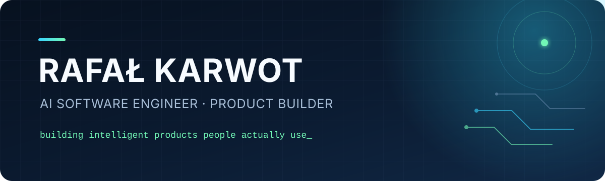

  

 

I'm an **AI Software Engineer & Product Builder** focused on turning LLMs into useful, reliable software — from agentic workflows and knowledge systems to complete products people can use.

- 🧠 I build with **LLMs, tool calling, RAG, agents, and intelligent automation**
- 🚀 I take products end to end: **AI, backend, integrations, infrastructure, and frontend**
- ⚙️ My foundations are **Python, FastAPI, distributed systems, and pragmatic architecture**
- 🎯 Currently building **SuperSeller, Maddie, and Citi Hunt**

## Products I'm building

<table>
  <tr>
    <td width="33%" valign="top">
      <h3><a href="https://superseller.pl">SuperSeller</a></h3>
      
<strong>AI customer service for Allegro sellers.</strong>

      
Controlled automation that answers repetitive buyer questions using the store's own knowledge and rules — while handing uncertain cases back to a human.

      
<a href="https://superseller.pl"><strong>Visit SuperSeller →</strong></a>

    </td>
    <td width="33%" valign="top">
      <h3><a href="https://getmaddie.com">Maddie</a></h3>
      
<strong>Your spoiler-free AI movie buddy.</strong>

      
A browser companion that watches along and answers questions about characters, relationships, music, and details you may have missed.

      
<a href="https://getmaddie.com"><strong>Meet Maddie →</strong></a>

    </td>
    <td width="33%" valign="top">
      <h3><a href="https://citi-hunt.io">Citi Hunt</a></h3>
      
<strong>Turn the city into an adventure.</strong>

      
A gamified urban experience built around exploration, real-world challenges, and discovering places from a new perspective.

      
<a href="https://citi-hunt.io"><strong>Explore Citi Hunt →</strong></a>

    </td>
  </tr>
</table>

## Selected engineering projects

### [Nava Triage](https://github.com/MORY33/triage-system)

AI-powered triage for housing cooperatives. It turns email, SMS, and voicemail into grouped, prioritized issues using an agentic LLM loop with tool calling and a feedback system that learns from admin corrections.

`Python 3.13` · `FastAPI` · `SQLModel` · `React` · `OpenRouter` · `Docker`

### [Queue Manager](https://github.com/MORY33/queue-orchestrator)

A full-stack queue management system for asynchronous background work, with task lifecycle management, retries, cancellation, and live status updates.

`FastAPI` · `Celery` · `Redis` · `PostgreSQL` · `React` · `TypeScript`

### [Python Data API](https://github.com/MORY33/pythop-data-api)

A Dockerized API for querying transport routes and detailed route points, including geographic coordinates, timestamps, and speed data.

`Python` · `REST API` · `Docker`

## Toolbox

  
  
  
  
  
  
  
  
  
  

  <a href="https://github.com/MORY33?tab=repositories"><strong>Explore all repositories →</strong></a>

